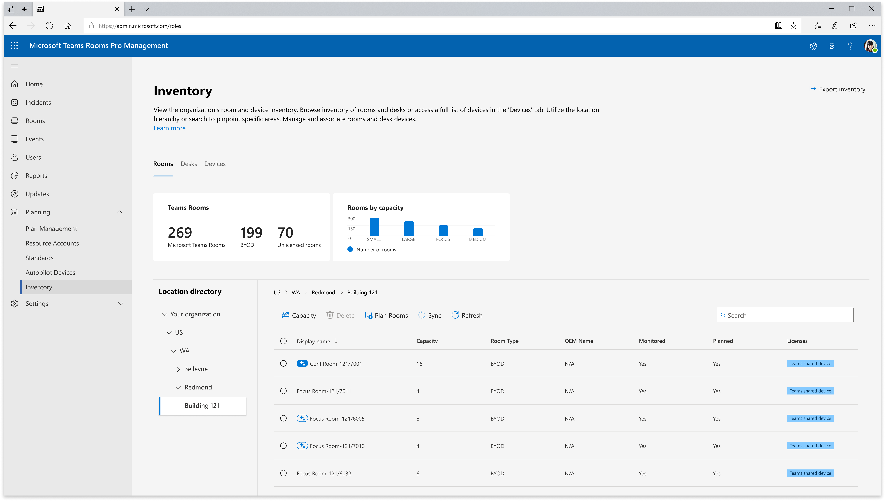

# Bring Your Own Device Rooms in Teams Pro Management portal

Bring Your Own Device rooms are identified as rooms with no Microsoft Teams Rooms. As an admin, you'll be able to:

1. View the inventory of BYOD rooms and peripherals in your tenant

1. Associate BYOD rooms and peripherals together, or view auto-associated rooms and peripherals. *Users who plug-in room associated peripherals will have [BYOD end user experiences automatically activated](https://support.microsoft.com/en-us/office/use-shared-display-mode-in-meeting-rooms-a59c6886-9028-44da-a3cc-5563be40a214) for the best meeting room experience.*

1. View usage and quality reports for BYOD rooms

> [!NOTE]
> To have access to the portal, you'll need at least one pro, premium, or Teams Shared Device (TSD) license.

## Overview

The BYOD rooms management solution uses the core concept of **association** between room peripherals and room resource accounts to create manageability and drive value for your organization.

A BYOD peripheral may be associated to a BYOD room in Pro Management portal. It can't be associated to more than one room. This association is anchored around a peripheral ID, which is a combination of the peripheral's product ID, vendor ID, and serial number.

When a peripheral is associated to a BYOD room, the Teams client application on your users' computer will send device signals required to construct this peripheral ID along with usage and meeting information. This usage information is then treated as usage of the peripheral's associated BYOD room, if there's one.

In addition, this association proves to the system that the peripheral is in a meeting room, allowing Teams to automatically activate BYOD end user experience features that optimize the client application for meeting room scenarios. [Learn more.](https://support.microsoft.com/en-us/office/use-shared-display-mode-in-meeting-rooms-a59c6886-9028-44da-a3cc-5563be40a214)

There are two manual ways and one automatic way in which this association can happen, discussed later in the article:

1. Manually associate peripherals to rooms individually

1. Manually associate peripherals to rooms en masse via a Powershell script

1. Let Pro management portal automatically associate peripherals for you

> [!WARNING]
> In order for a BYOD peripheral to be manageable in Pro Management portal, the serial number must be unique. Check with your peripheral manufacturer to see if the peripherals used in your organization satisfy this requirement. You may find that some are unique and some aren't, varying by manufacturer and even device model or firmware version.

## Viewing your BYOD Inventory

1. Open Pro Management Portal on [https://portal.rooms.microsoft.com/](https://portal.rooms.microsoft.com/)

1. In the left navigation menu, select **Planning** and then the **Inventory** option.

In the **Inventory** page, you'll find all the BYOD rooms and peripherals within your organization. There are two main tabs under **Inventory**: **Rooms** and **Devices**. The **Rooms** tab allows you to explore all of your rooms (including BYOD rooms, Microsoft Teams Rooms, and other).  The **Devices** tab is a flat list of all your BYOD Room and Bookable Desk peripherals.

### Rooms view

:::image type="content" source="../media/byod/inventory-rooms-tab.png" alt-text="Screenshot of Inventory rooms tab." lightbox="../media/byod/inventory-rooms-tab.png"::: 

The summary metrics show how many rooms of each type you have in your organization.

> [!IMPORTANT]
> A BYOD room is defined as any room that doesn't have a meeting enabled compute. In the Pro Management portal specifically, that means **any room that does not have a Microsoft Teams Room** or Surface Hub. These rooms may or may not have peripherals associated to them. These rooms are pulled from the Microsoft Admin Center and Exchange. A BYOD room that is hidden in the GAL won't appear in this view, nor is it manageable via the Pro Management portal.

- The following table describes the columns in the **Rooms** view of the Inventory. The Monitored and Planned columns aren't relevant for BYOD rooms.

  | Column | Description |
  | --- | --- |
  |Display name |Name of the room |
  |Capacity |Illustrate the room's capacity number |
  |Room type |Type of the room either Teams Rooms or Bring Your Own Device |
  |Monitored|Not relevant for BYOD rooms|
  |Planned|Not Relevant for BYOD rooms|
  |License Type |Type of license assigned to the room (e.g., Pro, Premium, Basic, Standard, Shared Device License, or Unlicensed) |
  
When you click on a room, you'll see the Room detail view.

#### Room detail view:

When you select a specific room, you'll see a new pane with two different pages, **General** and **Inventory** page.

- **The General tab** provides the following room information:

|Field|Description|
| --- | --- |
|Name|The name of the room |
|Seating Capacity|The room's capacity|
|Device type|Not relevant for BYOD rooms|
|OEM name |Not relevant for BYOD rooms|
|Account |The room resource account associated with the room in Exchange|
|Address |The physical address of the room (street, city, zip code, building, floor) |

- **The Inventory tab** displays detailed information about the room's devices. "Manage assets" isn't relevant for BYOD rooms.

| Column | Description |
| --- | --- |
| Name | Name of the device |
| Type | Type of device (for example, Microsoft Teams Rooms, TeamsPanel, camera.) |
| Make | Manufacturer name |
| SerialNumber | The device's serial number |

### Devices view

:::image type="content" source="../media/byod/device-view-latest.png" alt-text="Screenshot of Device view." lightbox="../media/byod/device-view-latest.png":::

The Device page offers a flat, searchable list of both BYOD and Bookable desk peripherals.

The peripherals are grouped by plug-in, which means if they're plugged in together, they're displayed as a group with the first device name as the primary device shown in the main table. When a peripheral is manually associated with a room, all of the other peripherals in its group also associate to that room.<br>
The **Number of devices** column shows the number of peripherals in the group.

Select the device to either view more details about peripherals in that group, or manually associate that group to a BYOD room or bookable desk.

#### Device detailed view:

When you select a specific peripheral group associated with a room, a new page opens up displaying the following two tabs:

- **Configuration**: This page displays information about the devices in the group including device serial number, product and vendor ID.
Under the device information, the button "**A****dd room or desk**" can be used to associate the peripheral to a BYOD room or bookable desk.
Once the devices get added to the specific room, the room's information will also be displayed such as the room's name, capacity, location and license type.
- **Usage details**: This page shows the room's usage report data for the selected period and is accessible with a Teams Shared Device license assigned to the room resource account.

-:::image type="content" source="../media/byod/device-discovery.png" alt-text="Screenshot of device room association." lightbox="../media/byod/device-discovery.png":::

#### Peripheral Auto Discovery and the Personal Device Filter

Peripherals are automatically discovered using your users' Teams client to send device data to Pro Management portal. When a user enters the prejoin screen of a meeting, any connected displays and USB audio/video peripherals are scanned and transmitted to the cloud. These peripherals populate your Devices tab within the Inventory navigation.

In order to ensure no personal peripherals get discovered or shown to admins, Pro Management portal uses a **personal device filter**. This filter requires that each peripheral be used by at least **five** unique users internal to the same organization before making the peripheral available for management.

> [!WARNING]
> Be aware that Microsoft can't guarantee that peripherals provide unique data like serial numbers, and this may cause errors or overcounting of usage. We recommend working with your OEM partners to ensure that your peripherals are providing unique serial numbers to the operating system via the USB descriptor or EDID. For composite audio video peripherals like AV bars, Teams looks at the audio component for peripheral information.

## BYOD powershell script for en-masse association

You can use a custom script to get peripheral details from rooms to locate peripherals correctly and ensure they're mapped to the corresponding room resource account. The PowerShell script located [here](https://www.microsoft.com/en-us/download/details.aspx?id=106063) must be run with administrator permissions.

For detailed step-by-step instructions, see [Get information for connected peripherals](../rooms/get-peripheral-information.md). After uploading information on peripherals, use the Inventory pages in the Pro Management portal to confirm they're associated to the correct BYOD rooms.

## Enabling automatic work location updates

You have the option to [enable the automatic work location update policy](/powershell/module/teams/new-csteamsworklocationdetectionpolicy) for your organization or for a group of users. Automatic work location updates are designed to enhance the end user experience by making it easier to keep their work location up-to-date and connect with others when they are in the office. With the policy enabled, users will have the option to enable automatic work location updates. They can do so in Teams desktop client under **Settings** > **Privacy** > **Sharing your work location**. After users have opted-in, their work location will automatically update to **In the office** when they connect to a BYOD room, provided their work location was previously set to unknown or remote. The detected location will last until the end of their working hours. If they plug in after work hours, the location will be set until 11:59pm that day. This feature allows for a seamless transition between remote and in-office work, which enhances collaboration and communication within your team and other users.

## Auto association

In order to reduce manual work required to build and maintain your BYOD inventory, Pro Management portal is capable of automatically associating peripherals to BYOD rooms by using signals provided by the Teams client application when users plug those peripherals into their computers and take meetings that have room bookings.

An auto associated room or peripheral is denoted by the blue sparkle iconography as shown below.



While Microsoft doesn't require nor recommend manual verification of auto associations, we have provided a tracking functionality for your organization should that be useful. Clicking on the blue sparkle symbol marks a room or peripheral as verified, turning the symbol's blue fill solid. Clicking on it again unverifies it. If a room is marked as verified, all of its associated peripherals are also marked as verified.

Auto association requires that multiple unique users provide these signals in order to ensure accuracy. The threshold for how many signals it requires before associating is configurable, so you can decide the right balance of association speed and accuracy for your organization, with a minimum of five unique signals and no maximum.


Microsoft encourages all organizations to make their BYOD rooms bookable in Exchange instead of using third party booking solutions to ensure maximum compatibility with auto association and BYOD management. Admins may also wish to encourage their users to book rooms when taking meetings to provide more signals for auto association.

## Usage and Quality Reports

> [!IMPORTANT]
> A Teams Shared Device license is required to unlock the Bring Your Own Device room usage report. For more information about the Teams Shared Device, see [Microsoft Teams Shared Devices licensing - Microsoft Teams | Microsoft Learn](../teams-add-on-licensing/teams-shared-device-license.md).

To view the Usage report for your Bring Your Own Device rooms:

1. In the left navigation menu, select **Reports**.
1. In the Reports page, select the **BYOD Usage** tab.  

   :::image type="content" source="../media/byod/usage-report.png" alt-text="Screenshot of Usage Report." lightbox="../media/byod/usage-report.png":::
   
   The headlines provide few rooms’ insights described in the following table:
   
   | Metrics | Description |
   |---|---|
   | **Total rooms** | Total number of Bring Your Own Device rooms |
   | **Unused rooms** | Number of Bring Your Own Device rooms with no calls |
   | **Used rooms** | Number of Bring Your Own Device rooms used based on calls made |
   | **Utilization** | Percentage of utilization of all Bring Your Own Device rooms across the tenant. <br> Utilization = Total call duration (all rooms) / (Workdays * workday hour * Bring Your Own Device rooms) <br> For example: If the tenant has 15 Bring Your Own Device Rooms, total call duration for all rooms is 300 h, work days = 10, work day hour = 8 h; then Utilization = 300/(10\*8\*15)= 25% |
   | **Audio and video calls** | Will generate the duration of the audio call and video camera |
   | **Overall call performance** | Overall Percentage of calls rated as “Good” out of the total calls in the room. Each call is evaluated and receives a Good, poor, Unknown rating. |
   | **Total calls** | Overall number of calls made in Bring Your Own Device rooms |
   
   Below the headline metrics, there's a table that provides a granular breakdown of individual Bring Your Own Device rooms, accompanied by specific metrics that illuminate each room’s usage and performance during the period selected. 
   
   | Column | Description |
   |---|---|
   | **Display room name** | The designated name of the Bring Your Own Device room |
   | **Room Type** | Will show as “Bring Your Own Device Room” as room type |
   | **Utilization** | The percentage of total call duration spent in a Bring Your Own Device room during business hours in the selected period. <br> For example, for a time period set to 10 Work days for room A, total call duration for room A is 12 h and Work Day Hour = 8 h; then room utilization = Total Call Duration in Room / (Work Days * Work Day Hour) = 12/(10\*8) =  15% |
   | **Total calls** | Total count of calls conducted in the room during the specified timeframe |
   | **Call performance** | Percentage of calls rated as “Good” out of the total calls in the room. Each call is evaluated and receives a Good, poor, Unknown rating. |
   
### Bring Your Own Device call utilization detailed view 

To see the call utilization view for each room, select the specific Bring Your Own Device room from the table. There will be a new pane, which gives a detailed view of devices call utilization based on selected period. 

> [!NOTE]
> Only rooms with Teams Shared Devices or Pro licenses and which are associated with their peripherals are shown in the Bring Your Own Device usage report.
> 
> Great news! for this first release, customers can utilize the Bring Your Own Device usage data without an additional Teams shared device license until April 8th, 2024.

## Settings

## Access Control & Configuration

### Turning off automatic discovery & usage data collection in the Teams client

The Teams BYOD solution uses peripheral data crowdsourced from the Teams client application running on user's computers to discover peripherals as well as understand when those peripherals (and the rooms they're associated to) are used. No personally identifiable data is collected, but should you feel that this data collection is inappropriate for certain users or groups in your organization, you may use the following PowerShell commands to enable or disable BYOD data collection via a Teams policy setting, as well as get the current policy setting status, create a new policy, and remove a policy.

> [!WARNING]
> Disabling this policy setting for certain users will cause BYOD and desk usage information to cease flowing to the service. The Teams BYOD and Desk solution requires peripheral data sent from users to calculate usage reports for peripherals, BYOD rooms, and desks.

```powershell
Get-CsTeamsBYODAndDesksPolicy
New-CsTeamsBYODAndDesksPolicy -Identity "Test"
Set-CsTeamsBYODAndDesksPolicy -Identity "Test" -DeviceDataCollection Disabled
Set-CsTeamsBYODAndDesksPolicy -Identity "Test" -DeviceDataCollection Enabled
Remove-CsTeamsBYODAndDesksPolicy -Identity "Test"
```

### Configuring Cloud Data

**BYOD Rooms and Desk management**

This setting option is located under the **General** tab in Teams Pro Management portal and controls if peripheral data is ingested into the cloud service. This feature is currently enabled by default, but admins have the option to disable it with this function. Disabling this setting will stop showing any usage reports for BYOD rooms or Desks, and also remove the display of any devices in the **Inventory** section, though those devices will continue to exist in the database.

**Delete Device Data**

This setting option enables admins to delete all device management data for a specific user.

### Inventory management permission

The inventory management permission in Teams Pro Management portal allows other users to view and manage the inventory management. You can create roles and grant other users permission to access inventory management and associate peripherals to rooms or desks.
### Configuring Auto Association

Auto association can be turned off for your organization in Pro Management portal's settings. In addition, the threshold for how many signals it requires before associating is configurable, so you can decide the right balance of association speed and accuracy for your organization, with a minimum of five unique signals and no maximum.

